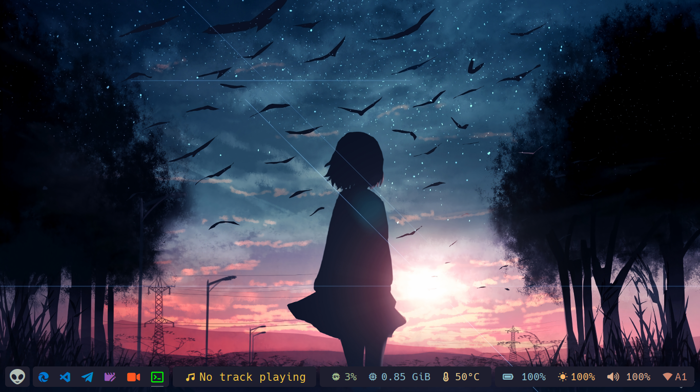

# BarOS

## ✨ Introduction
**BarOS** is a bash script created to install and configure a minimalist environment on Arch Linux with tools like **bspwm**, **Polybar** and many more. This script will automate the installation of packages, custom configurations, fonts, themes and other necessary tweaks for your system.

---

## 🔧 Characteristics

<div style="display: flex; align-items: center; flex-direction: row-reverse;">
  
  <table>
    <tr>
      <td><strong>Characteristics</strong></td>
      <td><strong>Package</strong></td>
    </tr>
    <tr>
      <td>OS</td>
      <td><a href="https://archlinux.org">Arch Linux</a></td>
    </tr>
    <tr>
      <td>WM</td>
      <td><a href="https://github.com/baskerville/bspwm">bspwm</a></td>
    </tr>
    <tr>
      <td>hotkey</td>
      <td><a href="https://github.com/baskerville/sxhkd">sxhkd</a></td>
    </tr>
    <tr>
      <td>Bar</td>
      <td><a href="https://github.com/polybar/polybar">polybar</a></td>
    </tr>
    <tr>
      <td>Theme</td>
      <td><a href="https://github.com/dracula/gtk">Dracula GTK</a></td>
    </tr>
    <tr>
      <td>Icons</td>
      <td><a href="https://github.com/m4thewz/dracula-icons">Dracula Icons</a></td>
    </tr>
    <tr>
      <td>Shell</td>
      <td><a href="https://www.zsh.org">zsh</a></td>
    </tr>
    <tr>
      <td>Terminal</td>
      <td><a href="https://sw.kovidgoyal.net/kitty">kitty</a></td>
    </tr>
  </table>
</div>

</br>

## 🔼 Installation

1. Clone the repository where this script is located:
   ```bash
   git clone https://github.com/drizzy/BarOS.git
   cd BarOS
   ```

2. Make sure the script has execute permissions:
   ```bash
   chmod +x setup.sh
   ```

3. Run the script:
   ```bash
   ./setup.sh
   ```


## 🔎 Script Details

### Installed Packages:

```bash
xorg-server, xorg-xinit, xorg-xrandr, xorg-xsetroot, xorg-xrdb, xf86-input-libinput, xf86-video-vesa, unzip, curl, bspwm, sxhkd, polybar, git, neovim, rofi, picom, zsh, kitty, neofetch, flameshot, feh, pipewire, pipewire-alsa, pipewire-audio, pipewire-jack, pipewire-pulse, playerctl, lsd, coreutils, libnotify, networkmanager, systemd, brightnessctl
```

### Main functions:

#### 1. **Dependencies:**
   - Automatic installation of packages required for the desktop environment.

#### 2. **Custom settings:**
   - Copy settings from the `configs` directory.
   - Automatic backup of existing configurations.

#### 3. [Compositor](https://github.com/yshui/picom)
   - Compositor installed: picom
   - Installing on the system and configuring.

#### 4. [App Launcher](https://github.com/davatorium/rofi)
   - App Launcher installed: rofi
   - Installing on the system and configuring.

#### 5. [Static Wallpaper](https://github.com/derf/feh)
   - Static Wallpaper tool installed: feh
   - Installing on the system and configuring.

#### 6. [Screenshot](https://flameshot.org)
   - Screenshot tool installed: flameshot
   - Installing on the system and configuring.

#### 7. [Nerd Fonts](https://github.com/ryanoasis/nerd-fonts)
   - Fonts installed Hack and NerdFontsSymbolsOnly
   - Installing on the system and updating the font cache.

#### 8. **Themes and Icons:**
   - Installing Dracula GTK theme and icons from GitHub repositories. *(optional)*

#### 9. **Other Settings:**
   - Installing [Powerlevel10k](https://github.com/romkatv/powerlevel10k).
   - Setting up [NvChad](https://nvchad.com) in Neovim.
   - Installing the [zsh-sudo](https://github.com/ohmyzsh/ohmyzsh/tree/master/plugins/sudo), [zsh-autosuggestions](https://github.com/zsh-users/zsh-autosuggestions), [zsh-syntax-highlighting](https://github.com/zsh-users/zsh-syntax-highlighting) plugins

---

## 💻 HotKeys

> Personal configuration, modify in ~/.config/sxhkd/sxhkdrc

| Shortcut  |  Action  |
| ------------------- | ------------------- |
| super + b   |  Open browser |
| super + c   |  Open code editor |
| super + g   |  Swap the current node and the biggest window |
| super + k   |  Open kdenlive |
| super + m   |  Alternate between the tiled and monocle layout |
| super + o   |  Open OBS |
| super + q   |  Close and kill program |
| super + s   |  Screenshot with flameshot |
| super + t   |  Open telegram |
| super + v   |  Open vlc |
| super + alt + {q,r}  | Quit/restart bspwm |
| super + alt + p   |  Launch system menu |
| super + alt + w   |  Launch wifi menu |
| super + shift + {1-6}   |  focus or send to the given desktop |
| super + Left   |  Move to the previous workspace |
| super + Right   |  Move to the next workspace |
| super + Return   |  Open terminal kitty |
| super + space   |  Launch apps menu |
| super + Escape   |  Reload sxhkd |

---

## ✨ Author
- **Willow P. (@drizzy)**
- [GitHub](https://github.com/drizzy)

---

## 💡 Notes
- Be sure to check each step and modify it to suit your system needs.
- This script is designed for Arch Linux based systems.